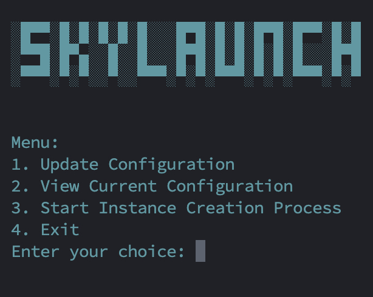
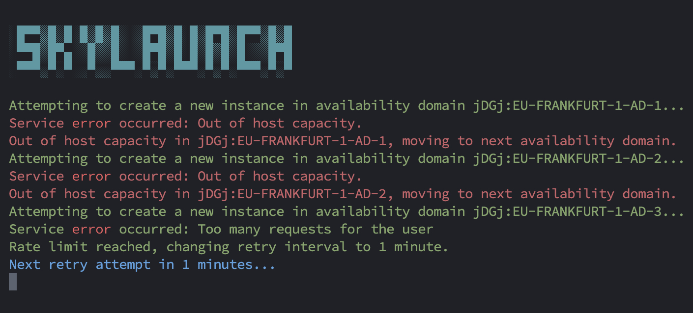

# SkyLaunch

## Quick Start

Run the following command to download, install dependencies, and run SkyLaunch:
```bash
bash -c "$(curl -fsSL https://raw.githubusercontent.com/g3ntrix/SkyLaunch/main/setup.sh)"
```
### Manual Setup

Clone the repository:

```bash
git clone https://github.com/g3ntrix/SkyLaunch.git
cd SkyLaunch
```

SkyLaunch is an interactive script for creating instances in Oracle Cloud Infrastructure (OCI). With SkyLaunch, you can easily configure and deploy virtual machines (VMs) while benefiting from automatic retries across multiple availability domains. This script is particularly advantageous for free-tier users who cannot use capacity reservations, ensuring that you can secure available capacity as soon as it becomes free.

## Screenshots

### Main Menu and Instance Creation Process

<table>
  <tr>
    <td></td>
    <td></td>
  </tr>
</table>

## Features

- **Interactive Setup**: User-friendly prompts guide you through the initial configuration.
- **Configuration Management**: Easily update and view your configuration settings.
- **SSH Key Support**: Option to deploy instances with or without SSH public keys.
- **Automated Retries**: Automatically retries instance creation across multiple availability domains if capacity is unavailable.
- **Dynamic Resource Fetching**: Automatically fetches available shapes and images based on selected criteria.

## Advantages

- **Maximize Free-Tier Benefits**: Free-tier users can't use capacity reservations. SkyLaunch ensures you can secure capacity as soon as it becomes available.
- **Time-Saving**: Automates the process of checking and retrying instance creation, saving you from manual intervention.
- **Flexibility**: Supports various shapes and images, allowing you to choose the best configuration for your needs.
- **Ease of Use**: The script’s interactive nature makes it accessible even for those who are not familiar with OCI.

## Requirements

- Python 3.x
- OCI
- colorma
- pip

### Prerequisites

- **OCI CLI Configuration**: Ensure you have the OCI CLI configured with your credentials. If you don't have the OCI CLI installed, follow these steps:
  1. Install the OCI CLI: Follow the instructions in the [OCI CLI Installation Guide](https://docs.oracle.com/en-us/iaas/Content/API/SDKDocs/cliinstall.htm).
  2. Configure the OCI CLI:
     ```bash
     oci setup config
     ```
     This will prompt you to enter your OCI credentials and create a configuration file at `~/.oci/config`.

- **SSH Keys**: If you wish to use SSH keys for accessing your instances, generate a public-private key pair if you don't have one:
  ```bash
  ssh-keygen -t rsa -b 2048 -f ~/.ssh/id_rsa
  ```

Use the path to your public key (e.g., `~/.ssh/id_rsa.pub`) during the script setup.

### Required OCIDs

Gather the following OCIDs from the OCI Console:

- **Compartment OCID**: Navigate to Identity > Compartments and find the OCID of the compartment where you want to create instances.
- **Subnet OCID**: Navigate to Networking > Virtual Cloud Networks, select your VCN, and find the OCID of the subnet where you want to place your instances.

### Recommended Environment

For optimal performance, run this script on a VPS or a computer with constant network access that remains powered on. Use tools like `screen` or `tmux` to keep the session open. For example, you can use `tmux` and then run the installation script.


